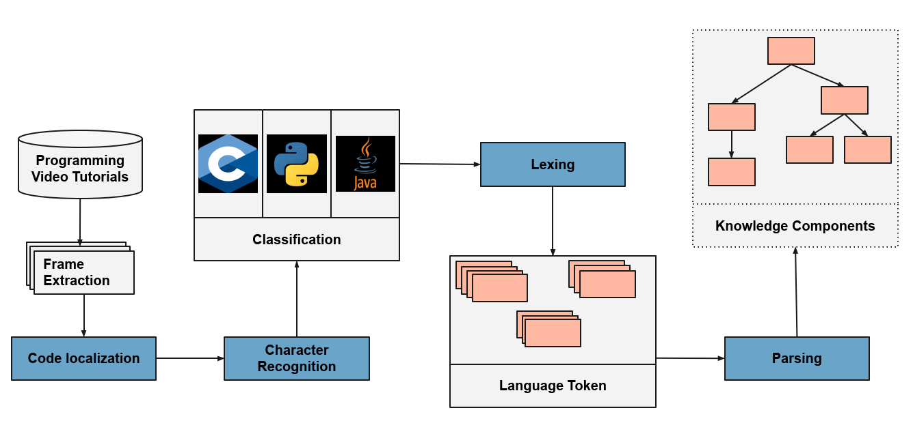

# Knowledge Component Extraction

This project aims to provide an application to extract, process and represent knowledge components from videos, particularly programming video tutorials. It locates presented source code in videos and uses the subframe for further processing resulting in a knowledge component tree representing all pre defined knowledge components. Processed videos can be categorized and suggested to learners based on their current objectives.
The source code is available to everyone under the MIT licence and you are very welcome to clone or fork the reposity, but keep in mind that this repository is mostly a proof-of-concept and the code is hardly optimized or refined.
Batteries not included: the trained `Classifier` to detect the programming languge and the `NeuralNet` to detect and locate source code in a given frame are not included since this code repository is implemented in a learning plattform and the deep learning algorithms are constantly trained and improved.

## Methodology

## Structure

The main components of this repository are structured as follows:

  * `analyzer/`: The core of the implementation handling initialization of every module and saving
    the extracted knowledge components

  * `classifier/`: Implementation of `LanguageClassifier` for classifying the programming language

  * `lexer/`: Implementation of different lexers based on the classifier programming language

  * `neural_net/`: Implementation of custom code detection and extraction using retrained
    `Yolo` and `Tesseract`

  * `parser/`: Implementation of parsing the tokens from the lexer, processing them and recursively build
    the knowledge component tree.
